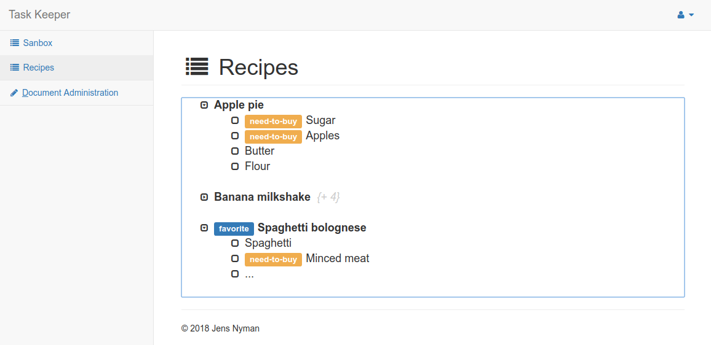

Task Keeper
===========

[](https://travis-ci.org/nymanjens/piga)

This project aims to be a list editor for power users.

Example use cases:

* A TODO list
* A list of meals and ingredients
* Notes from a meeting

## Features

*(Note: Some are not ready yet)*

* Document editing:
    * Productivity **shortcuts** for actions such as 'remove task', 'swap task down',
      'open link', 'convert selection to lower case', ...
    * Ability to **collapse** all indented tasks beneath selected task
    * Tasks can have **tags**
    * Ability to **search** in all documents
    * Taks can be **postponed** until a later date
* Many documents:
    * Easy **switching** between documents
    * Ability to **archive** documents and easily **search for documents**
* Works offline (via PWA)
* Dedicated mobile version

## Screenshot



## Installation from release

- Download the [latest release](https://github.com/nymanjens/piga/releases)
- Unpack the archive and open a terminal in the unpacked folder
- Run following commands to get the app running:

    ```
    # Create database tables
    bin/server -DdropAndCreateNewDb

    # Create admin user
    bin/server -DcreateAdminUser

    # Run application
    bin/server
    ```

- Browse to http://localhost:9000

## Installation with Docker

The following commands will launch a new server alongside a database in Docker containers:

```
# Get the docker-compose.yml file
wget https://raw.githubusercontent.com/nymanjens/piga/master/docker-compose.yml

# Choose a unique random string here of sufficient length
export APPLICATION_SECRET="$(cat /dev/urandom | tr -dc 'a-zA-Z0-9' | fold -w 32 | head -n 1)"

# Create an empty database with a single admin user
docker-compose run web bin/server -DdropAndCreateNewDb
docker-compose run web bin/server -DcreateAdminUser

# Bring up the server
docker-compose up
```

When done, browse to http://<ip_address>:9000/app/useradministration (username: "admin", password: "changeme")

## Configuration
- `conf/application.conf`:<br>
  Setup and configure a database here.
- Add users:<br>
  A default user is created with the `-DcreateAdminUser` flag (username: admin, password:
  changeme). This account can create new users.
